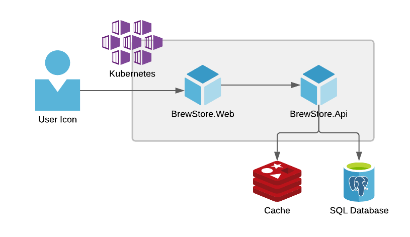

# Hello Distributed Application

Demo source to show up some experimentations with DotNet's Tye Project.

## Architecture Overview



The user access the **BrewStore.Web**, a DotNet 5 Razor Application that consumes over a REST API exposed over HTTP by **BrewStore.Api**, a DotNet 5 WebApi Application. The API stores data in a PostgreSQL Database and caches responses in a Redis Server.

## Get to run

To run the application is required to have installed and configured:

- [.Net 5 SDK](https://dotnet.microsoft.com/download)
- [Docker Engine](https://www.docker.com/products/container-runtime) (on Linux) or [Docker Desktop](https://www.docker.com/products/docker-desktop) (on Mac or Windows)
- [Tye Tool](https://github.com/dotnet/tye/blob/main/docs/getting_started.md) as `dotnet tool install -g Microsoft.Tye --version 0.9.*`

For development workflow

- [VS Code](https://code.visualstudio.com/)
- [Tye's VS Code Extension](https://marketplace.visualstudio.com/items?itemName=ms-azuretools.vscode-tye)

In `src` folder, use the following command:

```sh
$ tye run
```
